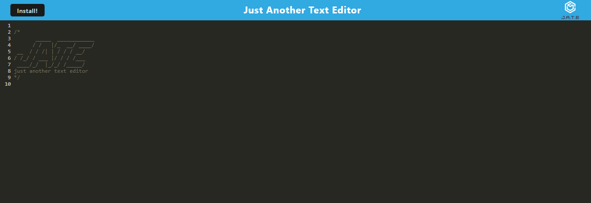

# PWA-Text-Editor

## Description
This application is a web text editor.  This application is designed and set up to be used as a PWA (Progressive Web Application).  You can enter any notes, code, or thoughts.  
## Technologies
Webpack, bundle
## GitHub
 [Repository](https://github.com/Preranashukla/PWA-Text-Editor.git).

## Deploy
The application is deployed to Heroku and can be found [Here](https://mypwa-app.herokuapp.com/).

## Screenshot

